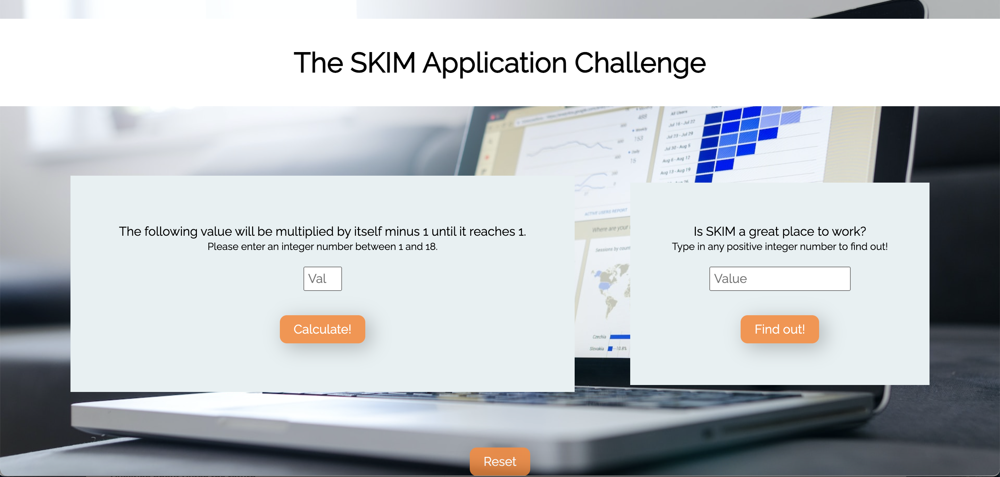

# <h2 align="center">The SKIM Application Challenge</h3>
*
By Milena Eickhoff
*

 

Thank you for this fun challenge. I am looking forward to presenting it soon. 

In case you need any clarification before my presentation, find a brief explanation here:
1. You will find a test.js file. After setting up a basic webpage using HTML and CSS I started to solve the challenge by creating a test file to see if I would generate the right solutions. For both challenges I found two different ways to solve them, using comments in the code I explain why I have chosen one method over another. After choosing a particular method I implemented it in the script.js file.
2. Many of my choices regarding my code are based on the Javascript Guidelines from mozilla.org that can be found <a href="https://developer.mozilla.org/en-US/docs/MDN/Writing_guidelines/Writing_style_guide/Code_style_guide/JavaScript" target="_blank">here</a>. I’m looking forward to discussing about them.

Kind regards,

Milena
